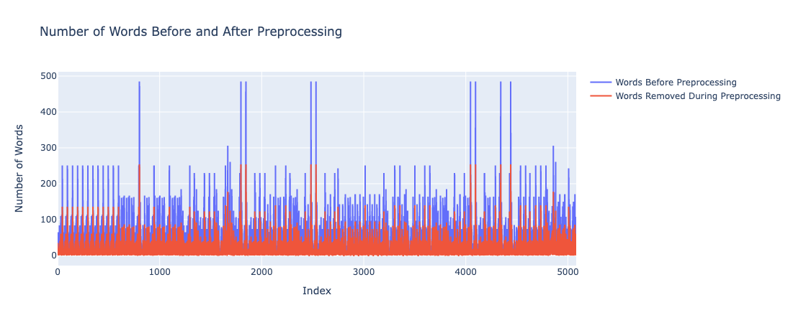

# eMAG Reviews Scraping Tool

This project extracts all reviews from a search result on eMAG.ro. It parses each and every result (product) and then it parses all of its reviews and analyses them.

## Some Key Features

- Translates all reviews from Romanian to English
- Preprocesses & Cleans the data

- Does TF-IDF and Feature Importance Analysis

- Performs Topic Modelling on the data

- Makes a Sentiment Analysis on each review
